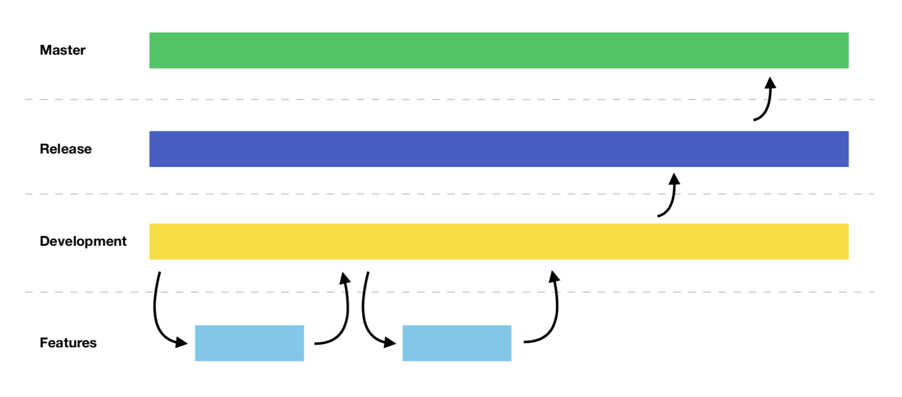

# Branching Strategy

In order to support the mobile development, continuous integration and delivery, testing and release process, the following branching strategy is proposed.

It's important that the naming convention is followed so we can reuse our CI scripts. CI scripts will use the name of the branch to understand and tune each build and how to distribute it.

## Summary
*Strongly* inspired in [this blog post](https://nvie.com/posts/a-successful-git-branching-model/).

|               | `main` | `development`|         `hotfix_`        | feature       | `release_`                   |
| ------------- |:--------:|:------------:|:------------------------:|:-------------:|:----------------------------:|
| Branched from | -        |   `main`   | `main`                 | `development` | `development`                |
| Merged into   | -        |   -          | `development` & `main` | `development` | `development` & `main`     |
| Can commit    | -        |   -          | ✅                        | ✅             | Only version, docs and fixes|

## Example

Also, [here's another example](branching-strategy/Git-branching-model.pdf).

### `main` branch
Consider `main` as a reflection of "production". `main` is irreversible and stable (always compiles and tests pass).

### `development` branch
This is where you will branch from most of the times. It's like `main` but ahead in commits since it contains changes that are not "live" now. `development` is also irreversible and stable (always compiles and tests pass).

### "Feature" branches
Actual work will happen here. Each branch should correspond to an entry in your issue tracker, **that could be a story, a bug, an item, a ticket, whatever it is that you call it**.

Issue 32 for "Client Mobile" could be `CM-32`. We want the PR branch name to contain the issue tracker's ticket id so it's easier to link them.

Before merging to `development`, the code changes need to be reviewed by a team member.

If these changes are not shipping as part of the next release, don't merge them yet. Make the PR and put it on hold.

### Hot fix branches
On rare occasions, `main` will present critical errors, or the business will require changes so urgent, that they can't go through the regular queue. For these cases, a hot fix branch can be created from `main`. Such branches should be named `hotfix_###`.

These are VERY similar to _"Feature" branches_ but they are branched from `main` instead of `development`.

Once the hotfix branch gets merged into `main` we need to propagate the changes into `development` as well. We do this by updating the `development` branch against `main` once the hotfix is merged. This way we can make sure that next time we merge a release candidate into `main` no conflicts are going to show up.

### `release` branches
So, you made a few changes to the app and the team decided to ship a new version. In order to reach `main`, we need to test and greenlight our code. That will happen in many places, but the definitive approval must come from the release candidate branches. Release branches are code-frozen, the only changes that we will introduce (if necessary) to these branches are:

- Version bumps
- Documentation changes (changelog files)
- Fixes to bugs found on these branches.

Release candidate branches will be named `release_{xxx.yyy.zzz}` (semver).

Once the release candidate gets greenlighted by QA, we proceed to merge it into `main`. Once the PR has been merged into `main`, we update `development` against `main`.

Also, **keeping a changelog file updated is encouraged**, it will be extremely useful when updating the store and adding some *"What's new"* copy. [Read more about this here](writing-changelogs.md)

✳️ In some situations, it may be appropriate and required to have a single, permanent `release` branch. For example, when using Azure DevOps for CI/CD, a branch must exist in order to define branch policies on it, to enforce the usage of pull requests, require a minimum number of reviewers, or to trigger the execution of a validation pipeline before allowing a PR to be merged.

## Tagging for releases

Even when the idea is that each release that we send to the Playstore/AppStore should be saved somewhere, in case that we need to rollback the version that we pushed, we want to keep track of the release candidates, we are doing so by tagging the branches prior to the releases.

We do this by simply running the git command `git tag <tag>` while being on the `main` branch after merging the release candidate PR, then we push the tag by running `git push origin <tag>`. If you are working with GitHub, get in sync with your team since probably it's a good idea to create releases based on the tags, but that dependes on each project.

To checkout any tag version you must simply run the git command `git checkout tags/<tag>`
